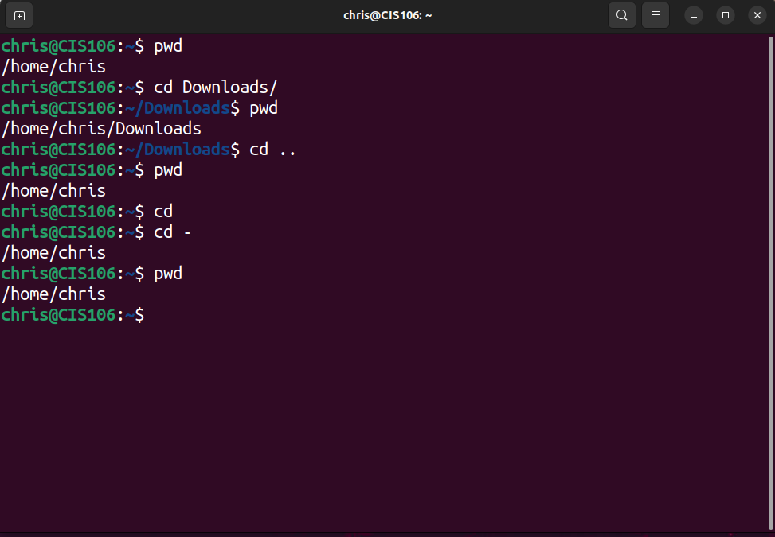
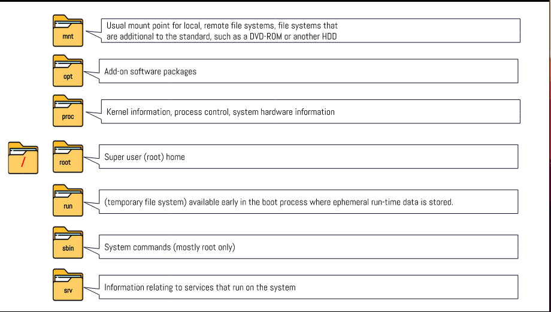
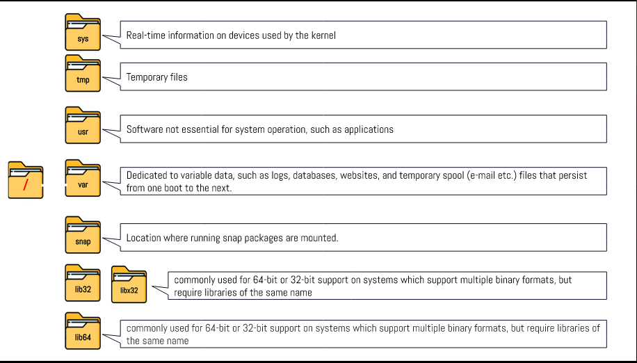

# Week Report 4

## PRACTICE FROM THE PRESENTATION THE LINUX FILE SYSTEM:

.png)

.png)

.png)

.png)

.png)

.png)

## THE LINUX FILE SYSTEM DIRECTORIES AND THEIR PURPOSE:

## ALL THE COMMANDS FOR NAVIGATING THE FILESYSTEM

| Command | What it does                                                                                                                                   | Syntax                        | Example                |
| ------- | ---------------------------------------------------------------------------------------------------------------------------------------------- | ----------------------------- | ---------------------- |
| pwd     | used for displaying the current working directory                                                                                              | `pwd`                         | `pwd` = `/home/chris`  |
| cd      | used for changing the current working directory to the home directory of the current user.                                                     | `cd` + `option` + `directory` | `cd /usr/share/themes` |
| ls      | used for displaying all the files inside a given directory. when no directory is specified, "ls" displays the files in the current directories | `ls` + `option` + `directory` | `ls -l`                |

## Basic terminology

+ File System - the way files are stored and organized
  
+ Current directory - directory where you are at the moment
  
+ Parent Directory - the subdirectory that is adjacent to the current working directory
  
+ The difference between your home directory and THE HOME directory - your home directory is the file where all of the files in, "home" are stored. "The home" directory can also be referred to as the root directory, where all files from the system stem from.
  
+ pathname - indicates the location of the file in the filesystem
  
+ relative path - the location of a file starting from the root of the file system
  
+ absolute path - then location of a file starting from the current working directory or a directory that is located inside the current working directory