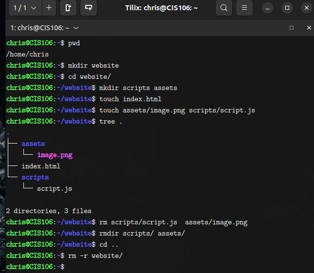
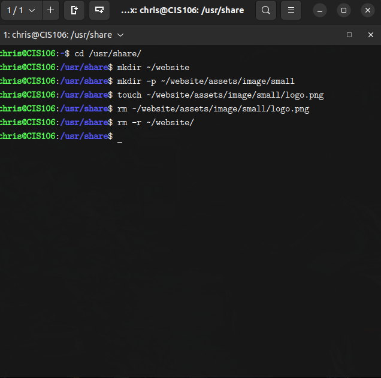
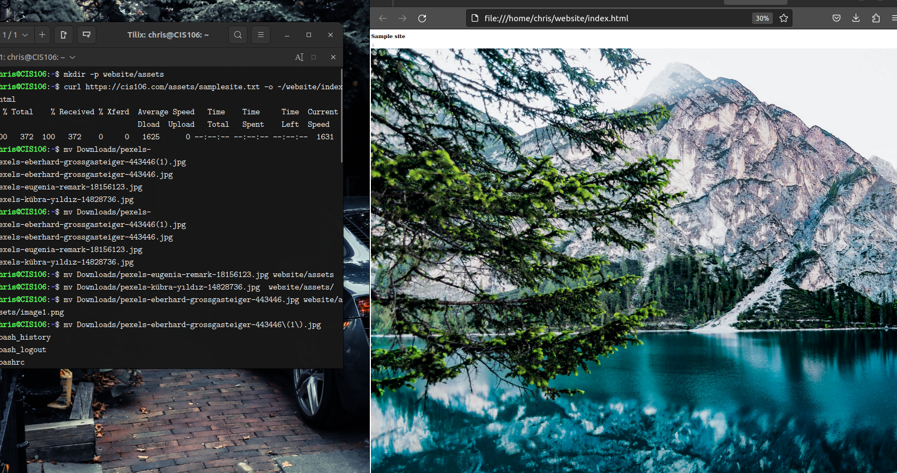
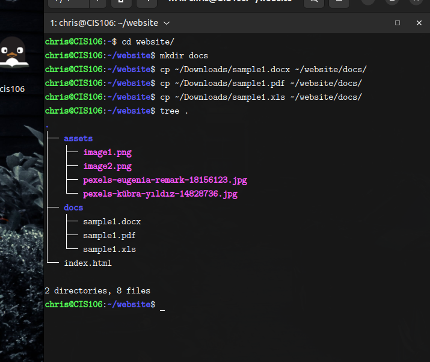

---
Chris Corona
Week report 5
Cis 106
---

## Questions

+   What are Command Options?
    +  settings or script that alters the default behavior of the program.
  
+   What are Command Arguments?
    +   parameters that are passed to a script while executing them in the bash shell.
  
+   Which command is used for creating directories? Provide at least 3 examples.
    + the commands used to make directories are:
      + mkdir - creates single directory or multiple directory
        + mkdir + name of directory
        + mkdir Downloads/game_stuff
        + mkdir ~/wallpapers/forest
+   What does the touch command do? Provide at least 3 examples.
    +   touch commands does the following:
        +   touch is used to create files
            +   touch + file name
            +   touch + file name + file name (if creating several files)
            +   touch + ~/Downloads/music.txt (using absolute path)
  
+   How do you remove a file? Provide an example.
    +   you can remove a file by using the rm command. it does not remove directories, must use the -r command if so.
        +   rm -r /Downloads
  
+   How do you remove a directory and can you remove non-empty directories in Linux? Provide an example
    +   to remove a directory, it must be empty meaning no files should be inside to completely remove it. Must use "-r" to remove a directory completely.
  
+    Explain the mv and cp command. Provide at least 2 examples of each
     +   mv command moves and renames directories. cp command copies files and directories from source to a destination.
         +   mv + source + destination
         +   cp + files/directory to copy + destination

## Practice Solutions

### Practice 1

.png)

### Practice 2

### Practice 3

### Practice 4
